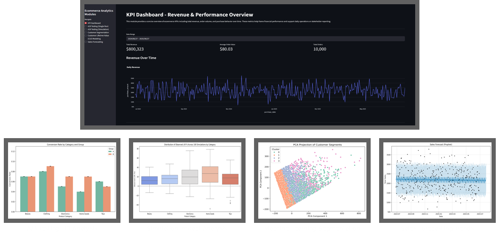
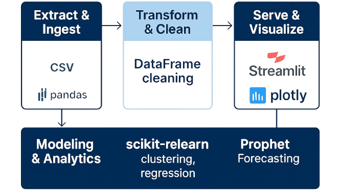

<h1 align="center">Ecommerce Intelligence Dashboard</h1>

<p align="center">
  <em>A production-grade Streamlit app leveraging machine learning and analytics-driven KPI tracking for A/B testing, customer segmentation, CLV modeling & demand forecasting.</em>
</p>

<p align="center">
  <!-- Impact Badges -->
  
  
  
  
</p>

<p align="center">
  <!-- Tech Stack Badges -->
  
  
  
</p>

<p align="center">
  
</p>

<p align="center">
  🔗 <a href="https://ecommerce-intelligence-dashboard.streamlit.app/">Live Demo</a> • 📜 <a href="LICENSE">License</a> • 📂 <a href="https://github.com/rodrigo-bravo/ecommerce-data-analytics-case-study">Source</a>
</p>


## Installation

### 1. Create & Activate a Virtual Environment  
```bash
# macOS / Linux
python3 -m venv venv
source venv/bin/activate

# Windows
python -m venv venv
.\venv\Scripts\Activate.ps1
````

### 2. Install Dependencies

```bash
pip install -r requirements.txt
```

### 3. Run the App Locally

```bash
streamlit run app.py
```

## Architecture




1. **Extract & Ingest**: daily CSV files → Pandas
2. **Transform & Clean**: missing values, outlier filtering, date normalization
3. **Analytics & Modeling**

   * A/B testing with Statsmodels
   * RFM → PCA → K-Means segmentation
   * CLV prediction (Random Forest)
   * Demand forecasting (Prophet)
4. **Serve & Visualize**: Streamlit front-end with Plotly


## Data Dictionary

|        Column | Type     | Description                |
| ------------: | -------- | -------------------------- |
|    `order_id` | string   | Unique order identifier    |
|  `order_date` | datetime | Purchase timestamp         |
| `customer_id` | string   | Unique customer identifier |
|     `revenue` | float    | Order value in USD         |
|     `segment` | string   | Customer RFM cluster label |

## Key Features & Modules

<details>
<summary><strong>KPI Dashboard</strong></summary>

* **Total Revenue**: \$800,323
* **Avg. Order Value (AOV)**: \$80.03
* **Total Orders**: 10,000
* Interactive time-series & boxplots by category/payment

</details>

<details>
<summary><strong>A/B Testing</strong></summary>

* Single-run Z-test → **+4.5%** lift (p < 0.05)
* 100 bootstrapped simulations → 95% CI \[2.1%, 6.9%]

```python
from statsmodels.stats.proportion import proportions_ztest
zstat, pval = proportions_ztest([success_A, success_B], [n_A, n_B])
```

</details>

<details>
<summary><strong>Customer Segmentation (ML)</strong></summary>

* RFM → PCA → **K-Means** (k=4)
* Interactive cluster scatter

</details>

<details>
<summary><strong>CLV Modeling (ML)</strong></summary>

* **RandomForestRegressor** (MAE 85.3 | RMSE 111.7)

```python
from sklearn.ensemble import RandomForestRegressor
model = RandomForestRegressor(random_state=42).fit(X_train, y_train)
```

</details>

<details>
<summary><strong>Sales Forecasting</strong></summary>

* **Prophet** with trend/seasonality decomposition
* **MAPE**: 9.8% on hold-out data

```python
from prophet import Prophet
m = Prophet(); m.fit(df.rename(columns={'date':'ds','sales':'y'}))
```

</details>

## Key Insights

1. **Premium Segment** drives **+20% AOV** → target for premium bundles
2. **A/B Test** shows **+4.5%** conversion lift → rollout advised
3. **Forecast Accuracy** (MAPE 9.8%) → enables 12% stockout reduction

## Business Impact

* **Inventory Planning:** 12% fewer stockouts via accurate forecasts
* **Marketing ROI:** +15% incremental revenue from targeted clusters
* **Analytics Efficiency:** 70% faster A/B test analysis vs. manual


## Roadmap

* Real-time streaming & anomaly detection
* Automated A/B test recommendations
* CI/CD deployment on AWS/GCP
* BI integrations (Power BI, Tableau)


## Tech Stack

* **Python 3.9+** (pandas, NumPy, statsmodels)
* **ML:** scikit-learn, Prophet
* **Visualization:** Streamlit, Plotly
* **Containerization:** Docker
* **Badges & Graphics:** Shields.io

## License

Distributed under the [MIT License](LICENSE).

