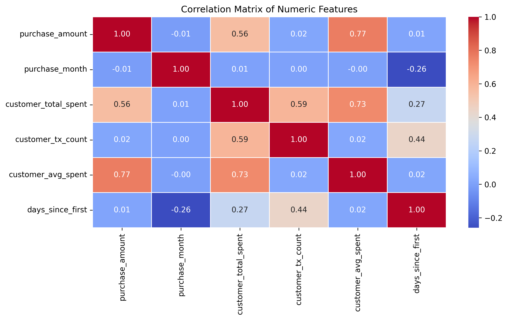
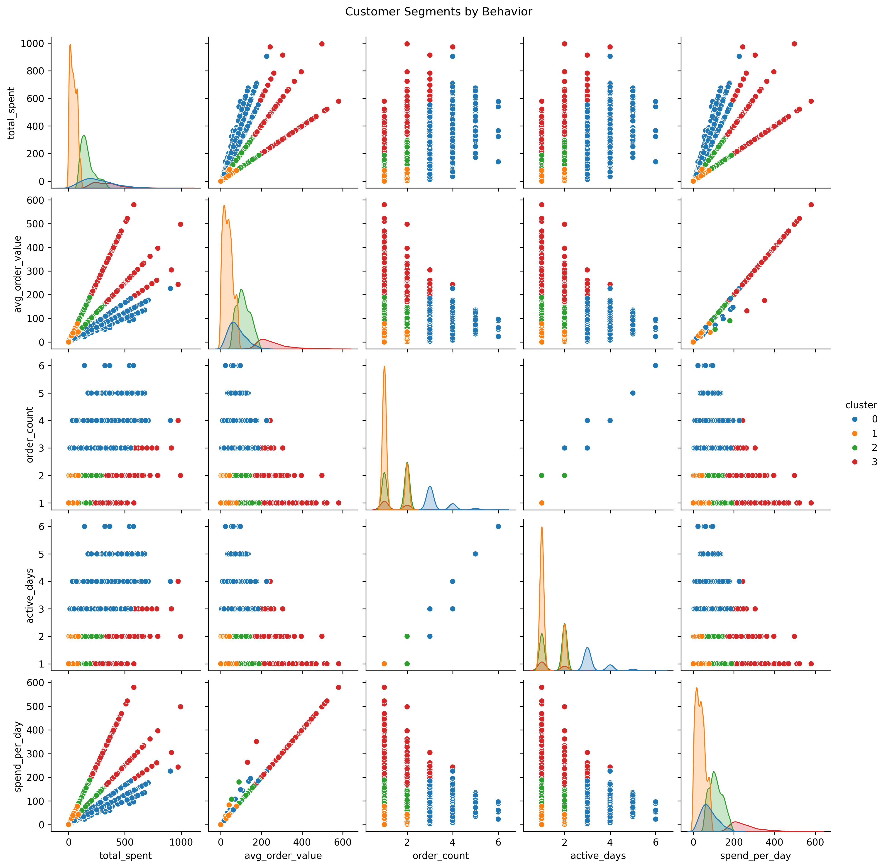
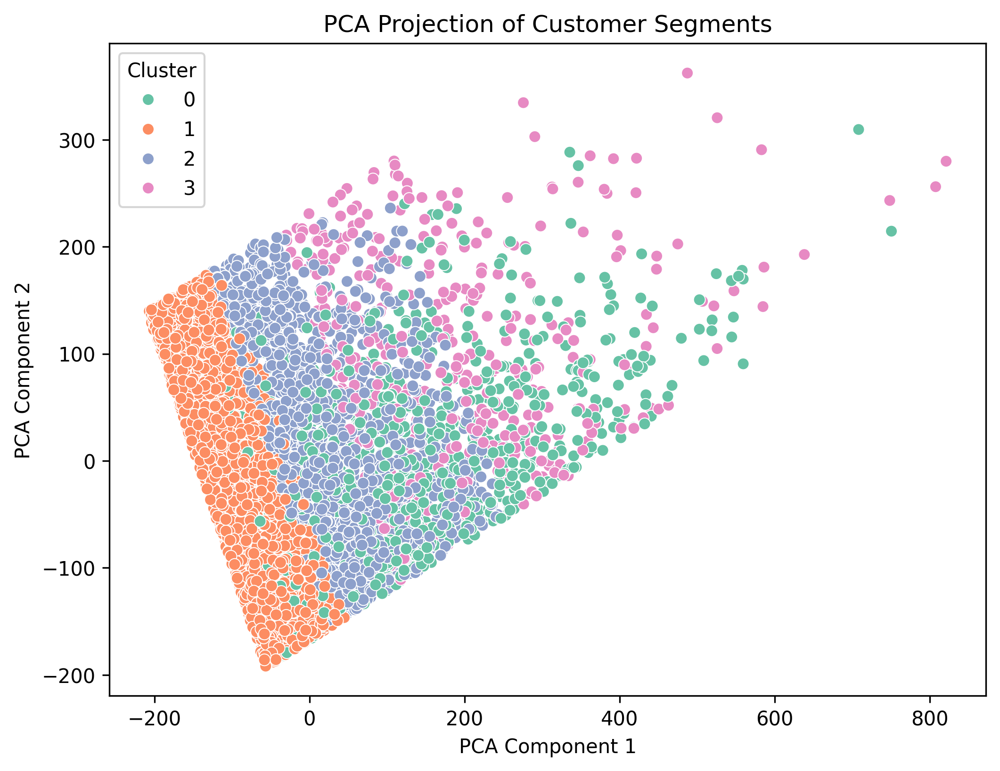
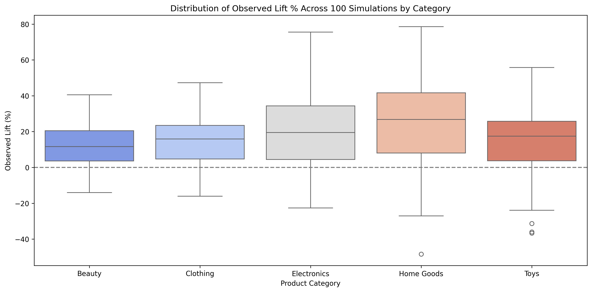
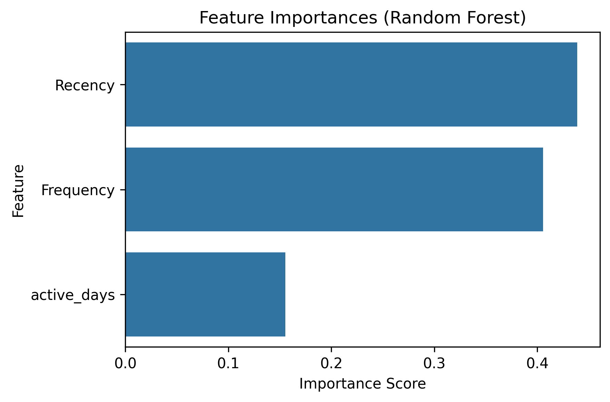

# E-commerce Data Analytics Case Study Dashboard

An interactive data analytics dashboard built in **Streamlit**, showcasing real-world **business intelligence**, **A/B testing**, **customer segmentation**, and **sales forecasting** insights via Jupyter Notebooks on simulated e-commerce data (10,000 sampled from 10M+ transaction records).

---

## Project Summary

This project simulates a real-world analytics workflow to uncover trends in customer behavior, optimize marketing strategy, and improve revenue performance. It demonstrates skills in:

- Data preprocessing & feature engineering  
- KPI tracking & dashboard development  
- A/B testing (single run & simulation-based inference)  
- Customer segmentation using KMeans & PCA  
- Customer Lifetime Value modeling using regression  
- Time series forecasting with Prophet  
- Visual storytelling using Plotly & Matplotlib  

---

## Live Demo on Streamlit Cloud

Explore KPIs, run simulated A/B tests, and uncover customer insights in an interactive interface.  
[Live App](https://temp-url.com) 

---

## Dashboard Preview
<table>
  <tr>
    <th>KPI Dashboard</th>
    <th>Customer Segmentation</th>
    <th>A/B Test Simulation</th>
    <th>CLV Modeling</th>
  </tr>
  <tr>
    <td>
      
    </td>
    <td>
      
      
    </td>
    <td>
      
    </td>
    <td>
      
    </td>
  </tr>
</table>


---

## Tech Stack

- **Languages:** Python, Markdown  
- **Libraries:** Pandas, NumPy, Scikit-learn, Plotly, Matplotlib, Seaborn, Prophet, Streamlit  
- **Tools:** Jupyter Notebook, Git, GitHub, Streamlit Cloud  

---

## Modules Included

| Module                       | Description                                                   |
|------------------------------|---------------------------------------------------------------|
| **KPI Dashboard**            | Visualizes sales, transaction patterns, payment methods       |
| **A/B Testing (Single Run)** | Measures lift and significance across 5 product categories    |
| **A/B Testing (Simulation)** | 100 simulation runs with lift variability distribution        |
| **Customer Segmentation**    | Clustering using Recency, Frequency, Monetary (RFM) metrics   |
| **CLV Modeling**             | Predicts future customer value using ML                       |
| **Sales Forecasting**        | Predicts future revenue using time series decomposition       |

---

## Local Setup Instructions

### 1. Clone the repository

```bash
git clone https://github.com/yourusername/ecommerce-data-analytics-case-study.git
cd ecommerce-data-analytics-case-study
````

### 2. Create and activate a virtual environment

```bash
python -m venv venv
venv\Scripts\activate
```

### 3. Install dependencies

```bash
pip install -r requirements.txt
```

### 4. Launch the Streamlit app

```bash
streamlit run app.py
```

---

## Folder Structure

```
ecommerce-data-analytics-case-study/
│
├── app.py                          # Streamlit application
├── README.md                       # Project documentation
├── requirements.txt                # Python dependencies
├── .gitignore                      # Ignored files/folders
│
├── assets/                         # Static visuals
│   ├── ab_testing/
│   ├── KPI_analysis/
│   └── customer_analytics/
│
├── notebooks/                      # Data analysis notebooks
│   ├── AB_Testing_Single_Run_Analysis.ipynb
│   ├── AB_Testing_Simulation_Analysis.ipynb
│   ├── Customer_Lifetime_Value_Modeling.ipynb
│   └── Customer_Segmentation_KPIs_Analysis.ipynb
```

---

## ✨ Project Highlights

### KPI Dashboard

Track real-time sales performance, average order value, payment methods, and product category trends using interactive and static visualizations.

### A/B Testing (Single Run)

Analyze the impact of experimental treatments on conversion across product categories with statistical rigor using z-tests.

### A/B Testing (Simulation-Based)

Simulate 100+ test runs to evaluate lift distribution and reliability across segments under randomized conditions.

### Customer Segmentation

Apply KMeans clustering and PCA projection on RFM features to identify behavior-based customer groups.

### Customer Lifetime Value Modeling

Use regression techniques to predict CLV and visualize revenue concentration among top-value customers.

### Sales Forecasting

Build a Prophet-based model to forecast revenue trends, decompose seasonality, and evaluate forecast accuracy using MAE and RMSE.

---

## Business Value

* Identifies top-performing product segments using A/B testing insights
* Uncovers customer behavioral clusters for targeted marketing
* Enables predictive CLV-based segmentation and budget planning
* Forecasts sales trends to support strategic planning and campaign timing
